# airflow-playground

Collection of hands-on Airflow DAGs for learning, experiments, and reference.

Topics covered are:

1. TaskFlow API Basics & Branching
2. XCom — Sharing Data Between Tasks
3. TaskFlow `.map()` and `.zip()`
4. Dynamic Task Mapping
5. Dynamic DAG Generation
6. Templating & Macros
7. Calling External APIs

Each DAG below is small and self-contained on purpose — one concept per file — so you can open the
file, read this description, and see exactly how the pieces connect.

## Table of Contents

- [1. TaskFlow API Basics & Branching](#1-taskflow-api-basics--branching)
- [2. XCom — Sharing Data Between Tasks](#2-xcom--sharing-data-between-tasks)
- [3. TaskFlow `.map()` and `.zip()`](#3-taskflow-map-and-zip)
- [4. Dynamic Task Mapping](#4-dynamic-task-mapping)
- [5. Dynamic DAG Generation](#5-dynamic-dag-generation)
- [6. Templating & Macros](#6-templating--macros)
- [7. Calling External APIs](#7-calling-external-apis)

---

## 1. TaskFlow API Basics & Branching

These DAGs use the `@dag` / `@task` decorator syntax (the "TaskFlow API") instead of instantiating
operators directly, and show how `@task.branch` picks which downstream task runs next.

### `dags/decorator_dag.py`

The baseline example. `start()` returns a string, and `choose_task()` — a `@task.branch` function —
uses that string to decide which single downstream task_id to run. Dependencies are wired with plain
`>>`, no manual `set_upstream`/`set_downstream` calls needed.

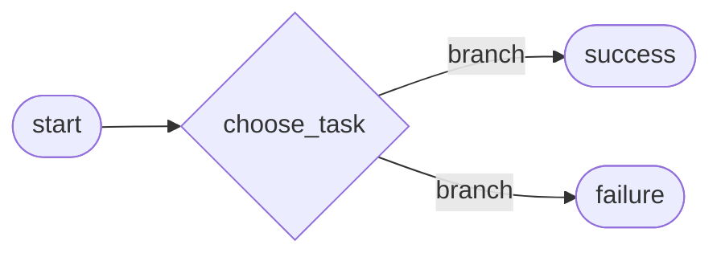

### `dags/decorator_dag_access_context_vars.py`

Same branching skeleton, focused on reading Airflow's runtime context inside a TaskFlow task. The
file shows three ways to do it (two commented out) and keeps `get_current_context()` active — it
returns the full context dict without adding extra parameters to the function signature. Also shows
per-task `retries`.

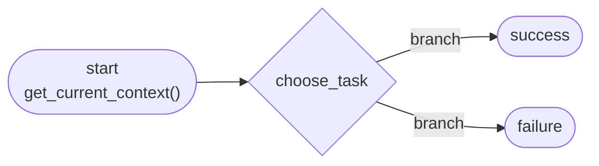

### `dags/decorator_dag_parameters.py`

Isolates one idea from the file above: passing task-level parameters — `@task(retries=3)`,
`@task(retries=1)` — to control retry behavior per task instead of at the DAG level.

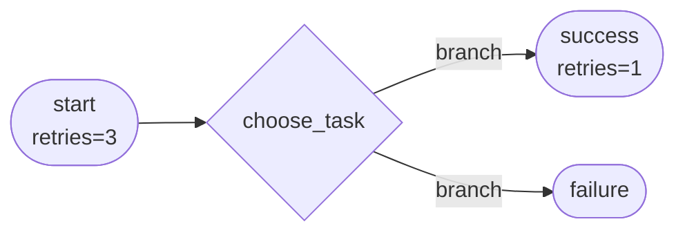

### `dags/taskflow_exp_dag.py`

An experimentation copy of the same branch pattern (different `dag_id`/`start_date`) — useful as a
scratch file while trying out `@task.branch` behavior without touching the reference examples above.


---

## 2. XCom — Sharing Data Between Tasks

XCom ("cross-communication") is how Airflow tasks pass small pieces of data to each other. These
DAGs progress from the fully manual API to the TaskFlow shortcuts that hide it.

### `dags/xcom_dag_manual_push_pull.py`

The lowest-level pattern. `task_a` grabs `**context` and calls
`context['ti'].xcom_push(key='my_key', value=val)` explicitly; `task_b` calls
`context['ti'].xcom_pull(task_ids='task_a', key='my_key')` to read it back. Since neither task
passes data through a function argument, the `>>` dependency has to be declared separately.

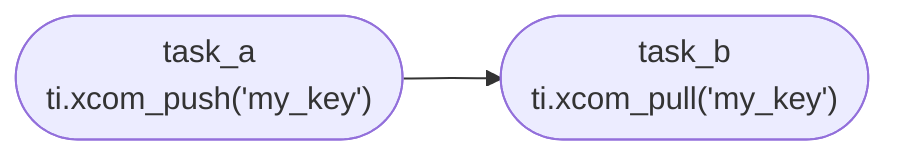

### `dags/xcom_dag_manual_multiple_values.py`

Extends the manual pattern to pull from *multiple* upstream tasks in one call:
`ti.xcom_pull(task_ids=['task_a', 'task_b'], key='my_key')` returns a list with one value per task.
Note it uses the plain `ti` argument shortcut instead of `**context`.

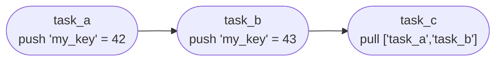

### `dags/xcom_dag_manual_better_way.py`

The "better way" the filename promises: let TaskFlow handle XCom automatically. `task_a()` returns a
value and passing it straight into `task_b(val)` pushes/pulls XCom under the hood — no
`xcom_push`/`xcom_pull` calls needed at all.

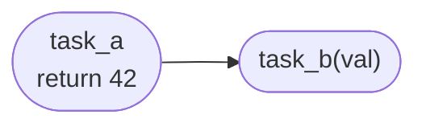

### `dags/xcom_args_traditional_way.py`

Bridges classic operators with implicit XCom. A `PythonOperator` (`start`) returns `42`; a
`BashOperator` references `start.output` (an `XComArg`) directly inside its `bash_command` string —
an alternative to the commented-out Jinja version, `{{ ti.xcom_pull(task_ids="start") }}`.

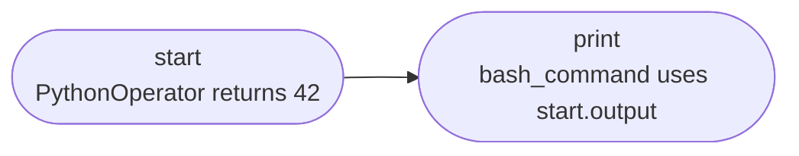

### `dags/xcom_args_sharing_dag.py`

Shows TaskFlow tasks returning a `dict` and downstream tasks indexing straight into it
(`values['my_val']`, `values['my_second_val']`) to fan a single upstream result out to multiple
arguments of the next task.

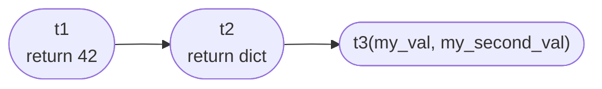

---

## 3. TaskFlow `.map()` and `.zip()`

`XComArg` objects (the return values of tasks/operators) support functional helpers so you can
transform or combine their data without spinning up extra mapped task instances.

### `dags/taskflow_api_map_dag.py`

`start` produces a list of folder paths. `.map(lambda path: path + 'data/')` lazily transforms every
item at runtime — similar to Python's built-in `map()` — and `end` consumes the transformed list as
a single input, no dynamic task mapping involved.

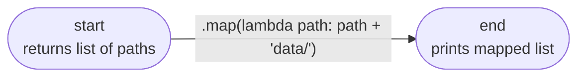

### `dags/taskflow_api_zip_dag.py`

Three independent tasks each return a list (paths, filenames, extensions). `.zip()` combines them
element-wise into tuples — like Python's `zip()` — and the result is unpacked as `op_args` for a
single `PythonOperator`.

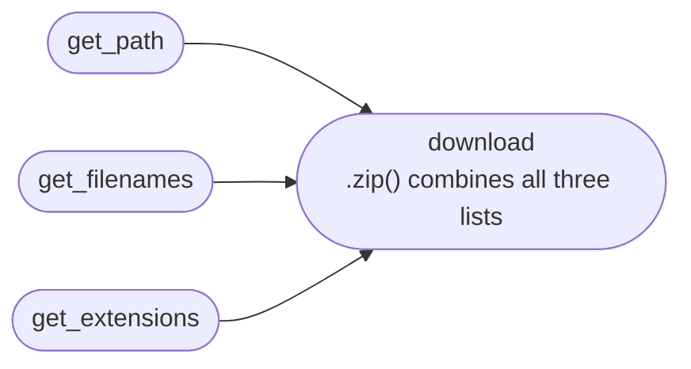

---

## 4. Dynamic Task Mapping

Dynamic task mapping (`.expand()` / `.partial()`) creates one task instance per item in a list —
useful when you don't know the number of items until runtime.

### `dags/dynamic_tasks.py`

The simplest case: `download_files.expand(file=["file_a", "file_b", "file_c"])` creates three mapped
instances of the same task, one per file in a static list.

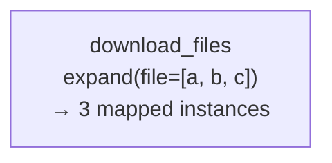

### `dags/dynamic_tasks_unknown_file_names.py`

Same idea, but the list to expand over comes from an upstream task (`get_files()`) instead of being
hardcoded — the number of mapped instances is only known at runtime.

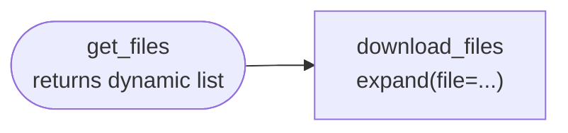

### `dags/dynamic_tasks_partial.py`

Adds `.partial()` to fix a constant keyword argument (`folder='/usr/local'`) while still expanding
over the dynamic list from `get_files()`. The resulting per-file bash command strings are then
expanded a second time into a `BashOperator`, chaining two rounds of dynamic mapping.

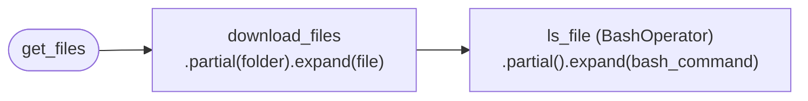

### `dags/dynamic_task_to_regular_task.py`

Shows mapped task instances fanning back into a single **regular** (non-mapped) downstream task.
`print_files`, a `BashOperator`, collects every mapped `download_file` result via a templated
`xcom_pull` call in its `bash_command`.

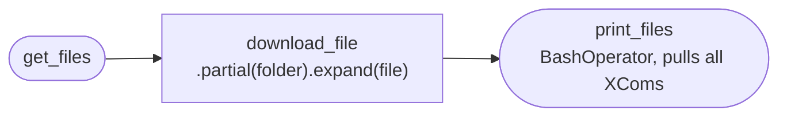

---

## 5. Dynamic DAG Generation

"Dynamic DAGs" means generating several DAG objects/files from one source instead of hand-writing
each one — useful when you have many near-identical pipelines that differ only by a parameter.

### `dags/process_file_a.py`, `dags/process_file_b.py`, `dags/process_file_c.py`

Three near-identical, hand-written DAGs (`process_file_a_dag`, `process_file_b_dag`,
`process_file_c_dag`). Each hardcodes one filename and runs the same `extract → process →
send_email` pipeline. They exist to show the repetitive "before" state that the two generation
techniques below eliminate.


*(`process_file_b.py` / `process_file_c.py` are identical, only the input filename changes.)*

### `dags/dynamic_dag_single_method.py`

Generates the three DAGs above **from a single file** at parse time: `create_dag(filename)` is a DAG
factory function, and a `for` loop over `['file_A', 'file_B', 'file_C']` calls it three times,
registering each result into `globals()` so the Airflow scheduler discovers `dag_file_A`,
`dag_file_B`, `dag_file_C` as three separate DAGs — no copy-pasted files needed.

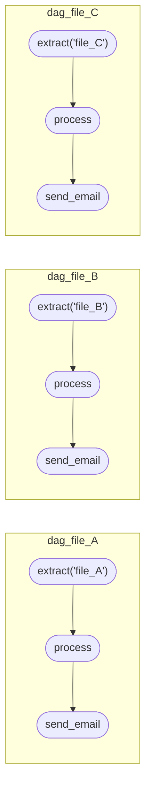

### `include/scripts/generate_dag.py` + `include/templates/dynamic_dag_multifile_method.py`

A second, offline approach: instead of generating DAG objects at parse time, this script generates
**real `.py` files on disk**. It reads one JSON config per DAG from `include/data/*.json` (each with
a `dag_id`, `schedule_interval`, and `input`), copies the placeholder template
(`dynamic_dag_multifile_method.py`, which contains `DAG_ID_HOLDER` / `SCHEDULER_INTERVAL_HOLDER` /
`INPUT_HOLDER`), and text-replaces the placeholders to materialize a finished
`dags/process_<dag_id>.py` file for each config. Run it once (e.g. `python
include/scripts/generate_dag.py`) whenever you add or change a JSON config.

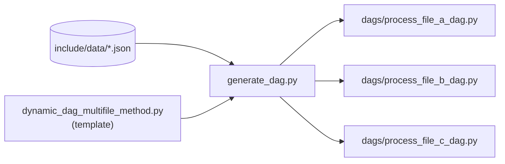

---

## 6. Templating & Macros

Airflow renders Jinja templates in operator fields at task execution time, giving access to
execution-date variables, DAG-run config, and custom macros.

### `dags/templating_dag.py`

The most basic case: `{{ ds }}` (the logical/execution date as `YYYY-MM-DD`) is rendered directly
inside the `sql` field of a `SQLExecuteQueryOperator` before the query runs.

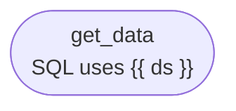

### `dags/templating_dag_bash.py`

Shows `template_searchpath=['include']`, which lets a `BashOperator`'s `bash_command` point at an
**external script file** (`scripts/script.sh`) instead of an inline string — Airflow still renders
Jinja templates found inside that file (e.g. `{{ data_interval_start.format('dddd') }}`).

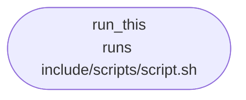

### `dags/templating_dag_macros.py`

Registers a custom Jinja macro via `user_defined_macros={'days_to_now': days_to_now}`, turning a
plain Python function into something callable inside templated fields:
`{{ days_to_now(data_interval_start, dag.start_date) }}`.

```mermaid
flowchart LR
    run_this(["run_this<br/>{{ days_to_now(...) }}"])
```

### `dags/templating_dag_python.py`

Demonstrates passing runtime DAG-run configuration into a task: `op_kwargs={"numbers": "{{
dag_run.conf['numbers'] }}"}` templates a value supplied when the DAG is triggered manually, and
`sum_numbers()` parses it safely whether it arrives as a JSON string, a Python-literal string, or an
already-parsed list.

```mermaid
flowchart LR
    sum_nb(["sum_nb<br/>op_kwargs from dag_run.conf"])
```

---

## 7. Calling External APIs

### `dags/sharing_dag_api.py`

Combines a provider operator with the TaskFlow API: `SimpleHttpOperator` calls a REST endpoint
(`GET /entries`) and pushes its response to XCom via `do_xcom_push=True`. The TaskFlow task
`parse_results` then receives that response through `.output` and parses it with `json.loads`.

```mermaid
flowchart LR
    get_api(["get_api<br/>SimpleHttpOperator GET /entries"]) --> parse_results(["parse_results<br/>json.loads(api_results)"])
```
